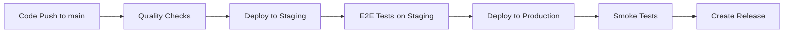

# 🚀 Deployment Pipeline Documentation

This document explains the new CI/CD pipeline structure for DateKeeper with automatic staging and production deployments.

## 📋 Pipeline Overview

The deployment pipeline consists of **3 sequential stages**:



## 🔄 Workflow Files

### 1. `main.yml` - Complete Pipeline
**Triggered by:** Push to `main` branch
**Purpose:** Complete end-to-end deployment pipeline

**Steps:**
1. ✅ **Quality Checks** (calls `ci.yml`)
   - Linting and formatting
   - Type checking
   - Unit tests
   - Build validation

2. 🧪 **Deploy to Staging**
   - Deploy to `datekeeper-staging.vercel.app`
   - Health check
   - E2E tests on staging environment

3. 🌐 **Deploy to Production**
   - Deploy to `datekeeper.vercel.app`
   - Health check
   - Smoke tests
   - Create GitHub release

### 2. `ci.yml` - Quality Checks Only
**Triggered by:** Push to any branch, PRs
**Purpose:** Code quality validation

**Jobs:**
- Linting and type checking
- Unit tests with coverage
- E2E tests (mocked)
- Build validation

### 3. `deploy.yml` - Manual Deployments
**Triggered by:** Manual workflow dispatch
**Purpose:** Manual deployment control

**Options:**
- Deploy to staging only
- Deploy to production only
- Deploy to both environments
- Rollback production

## 🌍 Environment Configuration

### Staging Environment
- **URL:** `https://datekeeper-staging.vercel.app`
- **Purpose:** Pre-production testing
- **Database:** Vercel Postgres (staging instance)
- **Tests:** Full E2E test suite

### Production Environment
- **URL:** `https://datekeeper.vercel.app`
- **Purpose:** Live application
- **Database:** Vercel Postgres (production instance)
- **Tests:** Smoke tests only

## 🔐 Required Secrets

Add these secrets to your GitHub repository:

### Vercel Secrets
```bash
VERCEL_TOKEN=your-vercel-token
VERCEL_ORG_ID=your-org-id
VERCEL_PROJECT_ID=your-project-id
```

### GitHub Secrets
```bash
GITHUB_TOKEN=auto-generated
```

## 🎯 Deployment Triggers

### Automatic Deployments
- **Main Pipeline:** Triggered on push to `main` branch
- **Quality Checks:** Triggered on push to any branch or PR

### Manual Deployments
- Use GitHub Actions UI
- Select `Deploy` workflow
- Choose environment: `staging`, `production`, `both`

## 🛡️ Safety Features

### Sequential Deployment
- Production deployment **only** happens after staging success
- Each stage must pass before proceeding to next

### Health Checks
- Automated health endpoint verification
- Wait periods for deployment stabilization
- Rollback capability for production

### Testing at Each Stage
- **CI:** Unit tests + mocked E2E tests
- **Staging:** Full E2E test suite
- **Production:** Smoke tests only

## 📊 Monitoring & Feedback

### GitHub Integration
- **Status Checks:** All stages show in PR/commit status
- **Releases:** Automatic release creation with deployment info
- **Comments:** PR comments with staging deployment links

### Vercel Integration
- **Environments:** Proper staging/production separation
- **Domains:** Automatic domain assignment
- **Analytics:** Environment-specific metrics

## 🚨 Failure Handling

### Staging Failure
- Production deployment is **blocked**
- Team is notified via GitHub status
- Manual investigation required

### Production Failure
- Staging remains available for testing
- Rollback workflow available
- Manual recovery procedures

## 🔧 Local Development

### Testing Deployments Locally
```bash
# Test staging-like environment
npm run dev:staging

# Test production build
npm run build:production
npm start
```

### Running E2E Tests
```bash
# Against staging
npm run test:e2e:staging

# Against production (smoke tests)
npm run test:e2e:production
```

## 📈 Pipeline Benefits

### 🎯 **Reliability**
- Staged deployments reduce production risk
- Comprehensive testing at each stage
- Automatic rollback capabilities

### 🚀 **Speed**
- Automated deployment process
- Parallel job execution where possible
- Quick feedback on deployment status

### 🔍 **Visibility**
- Clear deployment status in GitHub
- Automated release notes
- Environment-specific URLs

### 🛡️ **Safety**
- Production protected by staging validation
- Health checks at each stage
- Manual deployment controls available

## 🎉 Getting Started

1. **Set up secrets** in GitHub repository settings
2. **Configure Vercel projects** for staging and production
3. **Push to main branch** to trigger first deployment
4. **Monitor pipeline** in GitHub Actions tab

The pipeline will automatically:
✅ Run quality checks
✅ Deploy to staging
✅ Test staging deployment
✅ Deploy to production
✅ Test production deployment
✅ Create release with full deployment info

Your application is now **production-ready** with a **bulletproof deployment pipeline**! 🚀
